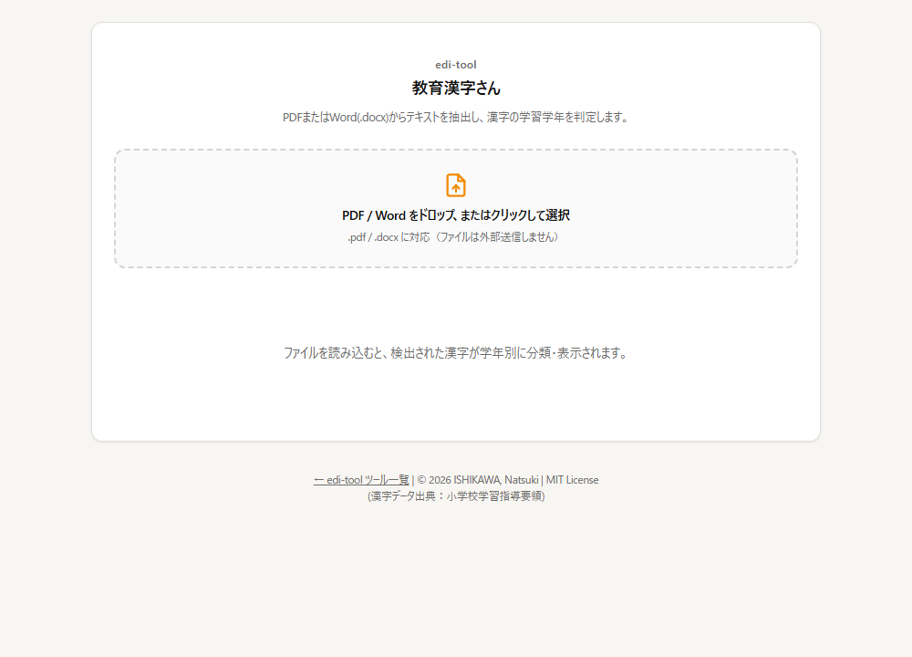

# 漢字学習学年判定ツール（教育漢字さん）

PDF・Word 内の漢字が小学校の何年生で習うもの（学年別漢字配当表）かを判定し、学年ごとに分類して表示するツールです。

🔗 https://edi-tool.github.io/edu-kanji-checker/



## 概要

文部科学省の学習指導要領に基づき、漢字の習得学年を特定します。
教育現場での資料作成や、お子様の学習状況に合わせたテキストの選定などに活用いただけます。

## 使い方

1. PDF または Word（.docx）ファイルを選ぶ（ドラッグ＆ドロップも可）
2. 文章中の漢字が第 1〜6 学年と「配当外」に分類され、学年別の分布・出現回数・前後の文脈が表示されます
3. 必要に応じて印刷します（全学年ぶんを印刷できます）

## データの扱い

- 読み込んだファイルは **ブラウザ内で解析し、外部サーバーへ送信しません**。
- 外部から読み込むライブラリ（cdn.jsdelivr.net）
  - [PDF.js](https://mozilla.github.io/pdf.js/)（pdfjs-dist 6.1.200）… PDF からのテキスト抽出
  - [Mammoth.js](https://github.com/mwilliamson/mammoth.js) 1.12.0 … .docx からのテキスト抽出

## 漢字データの出典

本ツールが判定に使用している学年別漢字データ（`kanji_data.js`）は、以下の公的資料に基づいています。

- **文部科学省「学年別漢字配当表」**（小学校学習指導要領 附録）
  - 第1学年：80字
  - 第2学年：160字
  - 第3学年：200字
  - 第4学年：202字
  - 第5学年：193字
  - 第6学年：191字
  - **合計：1,026字**

学年ごとの字数と、学年間に重複がないことはテスト（`npm test`）で確認しています。

## 仕様上の注意・制限事項

- **人名・地名**: 常用外漢字や、配当外の読み方であっても漢字自体が教育漢字であれば、その学年として判定されます。
- **文脈**: 前後 12 文字を、1 字につき最大 5 件まで表示します（出現回数はすべて数えます）。
- **解析制限**: 画像化されたPDF（スキャンデータ）や、パスワード保護されたファイルは解析できません。画像化された PDF ではテキストが取り出せず、「漢字が見つかりませんでした」と表示されることがあります。
- **正規化**: 解析前に Unicode 正規化（NFKC）を行います。

## 開発

ビルド工程はありません。`index.html` をそのまま GitHub Pages が配信します。

```bash
python -m http.server 8000   # プレビュー
npm test                     # テスト（Node.js 22 以上、依存パッケージなし）
npm run check                # HTML の静的チェック
```

- テストは `index.html` を変更せずに判定関数を取り出して実行します（`tests/`）。
- 変更履歴は [CHANGELOG.md](CHANGELOG.md) を参照してください。
- 開発方針は [edi-tool 開発原則](https://github.com/edi-tool/.github/blob/main/PRINCIPLES.md) に従います。

## 参考文献 / References

本プロジェクトの開発にあたり、以下の資料およびデータを参照・利用させていただきました。

### 公的資料

- [小学校学習指導要領（平成29年告示）解説 国語編](https://www.mext.go.jp/a_menu/shotou/new-cs/youryou/syo/koku/__icsFiles/afieldfile/2016/10/27/1234920.pdf) - 文部科学省
  - 漢字配当表の公式基準として参照

### データ・リポジトリ

- [mimneko/kanji-data](https://github.com/mimneko/kanji-data)
  - 漢字データの構造化におけるベースデータとして利用
- [学年別漢字配当表に基づく漢字データベース](https://denki.nara-edu.ac.jp/~yabu/edu/kanji/kanji3.html) - 藪 哲郎（奈良教育大学）
  - 漢字情報のクロスチェックおよび補足データとして参照

### システム

- [Mammoth.js](https://github.com/mwilliamson/mammoth.js)
  - 本ツールのシステムの参考

### デザイン

- [kzhrknt/awesome-design-md-jp](https://github.com/kzhrknt/awesome-design-md-jp)
  - 本ツール（index）のデザインの参考

## 関連ツール

- [表外漢字判定ツール（常用漢字さん）](https://edi-tool.github.io/kanji-checker/) — 常用漢字表にない漢字を検出
- [edi-tool のツール一覧](https://edi-tool.github.io/)

## ライセンス

MIT License © 2026 ISHIKAWA, Natsuki（[LICENSE](LICENSE)）

実行時に読み込む PDF.js（Apache-2.0）・Mammoth.js（BSD-2-Clause）は、それぞれのライセンスに従います。
